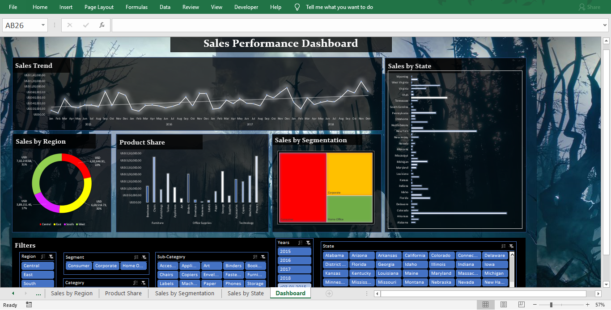
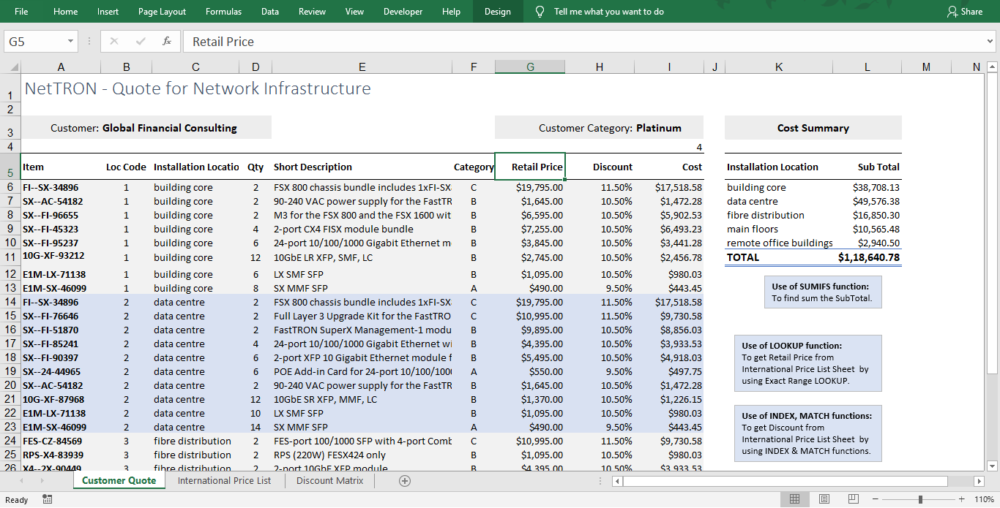
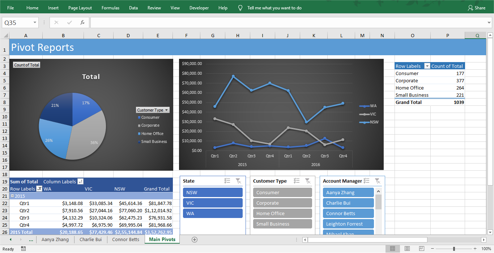
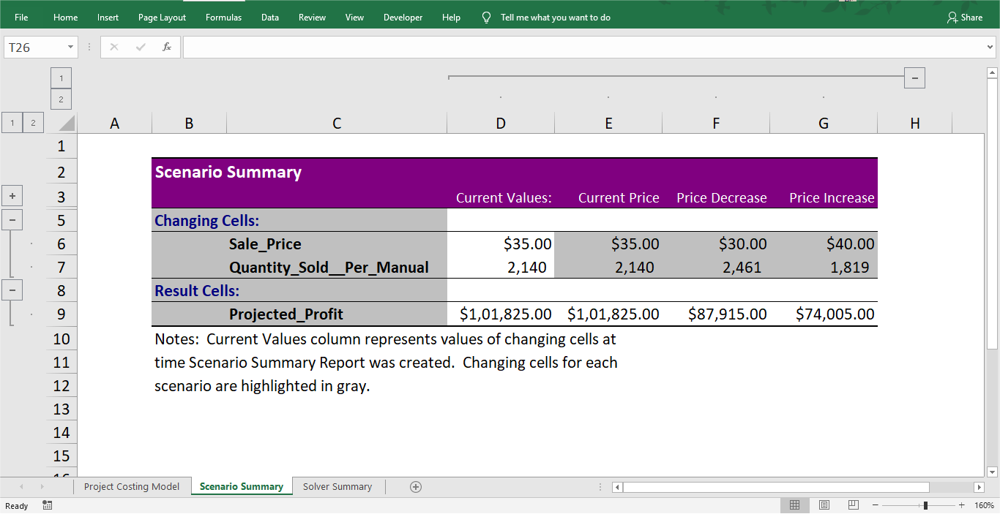
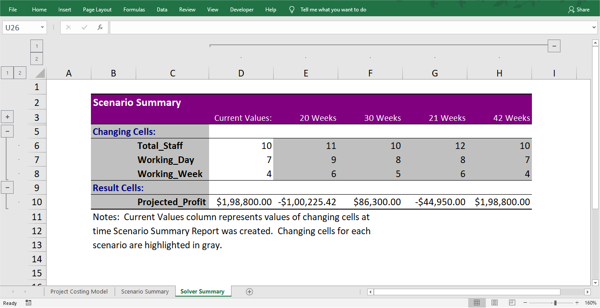
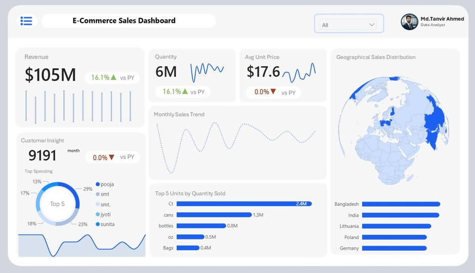
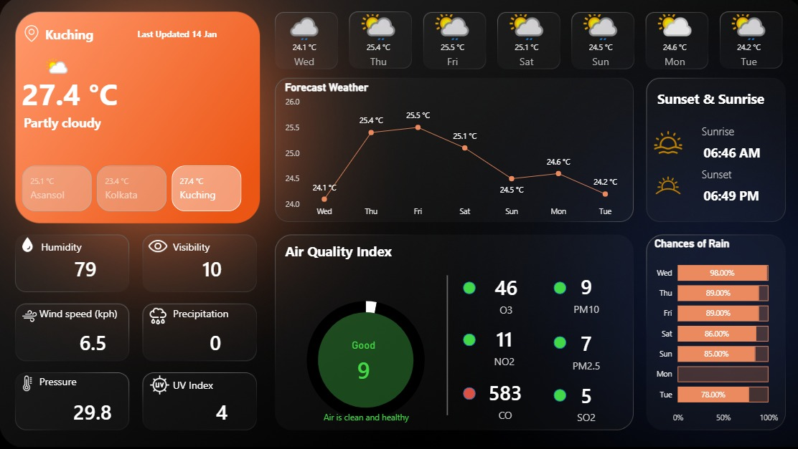
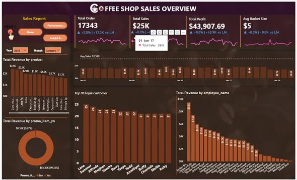
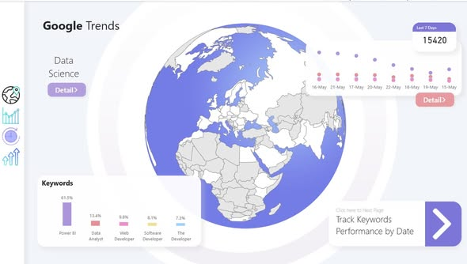

## 🔗 Connect With Me

👤 **Md. Tanvir Ahmed**  
📎 [LinkedIn](https://www.linkedin.com/in/mdtanvirahmeddev/)  
📊 [Tableau Public Portfolio](https://public.tableau.com/app/profile/md.tanvir.ahmed8315/vizzes)

---

# 📊 Data Analyst Portfolio Projects

Welcome to my Data Analyst portfolio repository!  
Here you'll find a collection of projects showcasing my skills in **SQL, Python, Excel, and Data Visualization**.

---

## 🔧 Tools & Technologies

- **SQL** (PostgreSQL, HiveQL)
- **Python** (Pandas, Matplotlib, Seaborn)
- **Excel** (Advanced Functions, Dashboards, Solver)
- **Tableau** (Dashboards & Interactive Visualizations)

---

## 📁 Project Categories

### 📌 SQL Projects

- 🧹 [SQL - Data Cleaning](https://github.com/md-ahmed-tanvir/DataAnalystPortfolioProjects/blob/main/SQL%20-%20Data%20Cleaning.sql)  
  Cleaning and preparing raw data using SQL queries.

- 🔍 [SQL - Data Exploration](https://github.com/md-ahmed-tanvir/DataAnalystPortfolioProjects/blob/main/SQL%20-%20Data%20Exploration.sql)  
  Exploratory analysis using filtering, joins, and aggregations.

- 📷 [Instagram Clone – Schema & Insertion](https://github.com/md-ahmed-tanvir/DataAnalystPortfolioProjects/blob/main/Instagram%20Clone%20SQL%20-%20Database%20%26%20Inserting%20Data.sql)  
  Simulated database schema design and data insertion.

- 📈 [Instagram Clone – EDA](https://github.com/md-ahmed-tanvir/DataAnalystPortfolioProjects/blob/main/Instagram%20Clone%20SQL%20-%20Exploratory%20Data%20Analysis.sql)  
  User insights and performance analytics with SQL.

- 🚕 [NYC Yellow Taxi Case Study – HiveQL](https://github.com/md-ahmed-tanvir/DataAnalystPortfolioProjects/blob/main/Hadoop(Hive)%20-%20NYC%20Yellow%20Taxi%20Case%20Study.txt)  
  Big data analysis using Hive on Hadoop.

- 🐘 [PostgreSQL BI Challenge](https://github.com/md-ahmed-tanvir/DataAnalystPortfolioProjects/blob/main/PostgreSQL-BI-CHALLENGE)  
  Business intelligence use case using PostgreSQL (file/directory-based project).

---

### 🐍 Python Projects

- 🎬 [Movie Industry EDA](https://github.com/md-ahmed-tanvir/DataAnalystPortfolioProjects/blob/main/Python%20-%20Movie%20Industry%20EDA%20Project.ipynb)  
  In-depth exploration of the movie industry using Pandas, Seaborn, and Matplotlib.

---

### 📊 Excel Projects

- 📈 [Sales Performance Dashboard](https://github.com/md-ahmed-tanvir/DataAnalystPortfolioProjects/blob/main/Excel%20-%20Sales%20Performance%20Dashboard.xlsx)  
  Interactive dashboard with slicers and charts for executive-level insights.

- 📌 [Lookup, Index, Match, SumIFS](https://github.com/md-ahmed-tanvir/DataAnalystPortfolioProjects/blob/main/Excel%20-%20LOOKUP%2C%20INDEX%2C%20MATCH%2C%20SUMIFS.xlsx)  
  Advanced Excel functions used for dynamic data retrieval and analysis.

- 📊 [Pivot Tables, Pivot Chart, Slicers](https://github.com/md-ahmed-tanvir/DataAnalystPortfolioProjects/blob/main/Excel%20-%20Pivot%20Tables%2C%20Pivot%20Chart%2C%20Slicers.xlsx)  
  Data summarization and filtering with pivot tools.

- 📈 [Scenario Manager & Solver (Data Modeling)](https://github.com/md-ahmed-tanvir/DataAnalystPortfolioProjects/blob/main/Excel%20-%20Scenario%20Manager%2C%20Solver%20(Data%20Modeling).xlsx)  
  Business decision-making using Solver and Scenario Manager.

📎 **Note:** *Kindly download these Excel files from this repository and view them in Microsoft Excel.*

#### 🔍 Visual Highlights

- **Sales Superstore Sample** – *Sales Performance Dashboard*  
  

- **NetTRON Infrastructure Data** – *LOOKUP, INDEX, MATCH, SUMIFS*  
    
  

- **Shipping Data** – *Pivot Tables, Pivot Chart, Slicers*  
  

- **Project Costing Model** – *Scenario Manager & Solver (Data Modeling)*  
    
    
  

---

## 📊 Power BI & Tableau Visualizations

Explore my interactive **Tableau dashboards** and **data storytelling projects**, designed to deliver clear insights through compelling visuals.

🔗 **[View Tableau Public Portfolio](https://public.tableau.com/app/profile/md.tanvir.ahmed8315/vizzes)**

### 🔍 What you’ll find:
- 📈 Sales Performance Dashboards  
- 📱 App & User Analytics  
- 🌍 Geographic & Regional Insights  
- 📊 Interactive Visual Stories  

Each project focuses on transforming raw data into **actionable business insights** using modern visualization best practices.

---

> ⭐ *Star this repository if you find it useful, and feel free to connect or fork for collaboration!*

📄 **LICENSE & LEGAL WARNING NOTICE**

© 2025 **Md. Tanvir Ahmed** — *All Rights Reserved.*

This repository and all of its contents are the **exclusive intellectual property** of **Md. Tanvir Ahmed**.
Every line of code, design element, and resource herein is **fully protected under international copyright and digital property law**.

---

### 🚫 ABSOLUTELY PROHIBITED ACTIONS

The following actions are **strictly forbidden** without prior written authorization from the owner:

* ❌ Downloading or cloning this repository
* ❌ Copying, redistributing, or reproducing any content
* ❌ Altering, reverse-engineering, or re-uploading any material
* ❌ Using this work for academic submissions, commercial projects, or derivative works

---

### ⚠️ LEGAL CONSEQUENCES

Any unauthorized access, download, duplication, or redistribution will be treated as **intellectual property theft** and may lead to:

* 📛 **Immediate DMCA takedown requests** against all offending repositories and mirrors
* 🧾 **Formal copyright infringement reports** filed to GitHub and relevant authorities
* ⚖️ **Civil and criminal legal action** under applicable national and international law

GitHub and associated digital forensics teams may be contacted for **account trace verification, IP logging, and evidence preservation**.

---

### 👁️ PERMITTED USE

You are allowed **to view this repository online for personal, non-commercial reference only**.
Any other action constitutes a violation and will trigger immediate enforcement procedures.

---

### 🛡️ FINAL NOTICE

**All activity on this repository is monitored and logged.**
Unauthorized users will be **reported, blacklisted, and subject to legal pursuit.**

Respect intellectual property.
**Violation of these terms will result in immediate and permanent consequences.**
