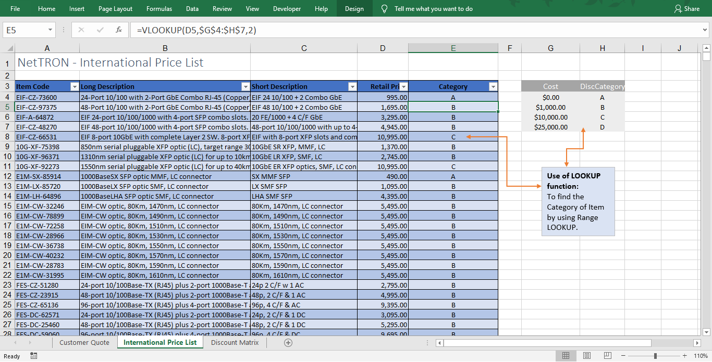

## 🔗 Connect With Me

👤 **Md. Tanvir Ahmed**  
📎 [LinkedIn](https://www.linkedin.com/in/mdtanvirahmeddev/)

# 📊 Data Analyst Portfolio Projects

Welcome to my Data Analyst portfolio repository!  
Here you'll find a collection of projects showcasing my skills in **SQL, Python, Excel, and Data Visualization**.

---

## 🔧 Tools & Technologies

- **SQL** (PostgreSQL, HiveQL)
- **Python** (Pandas, Matplotlib, Seaborn)
- **Excel** (Advanced Functions, Dashboards, Solver)
- **Tableau** (Dashboards & Interactive Visualizations)

---

## 📁 Project Categories

### 📌 SQL Projects

- 🧹 [SQL - Data Cleaning](https://github.com/md-ahmed-tanvir/DataAnalystPortfolioProjects/blob/main/SQL%20-%20Data%20Cleaning.sql)  
  Cleaning and preparing raw data using SQL queries.

- 🔍 [SQL - Data Exploration](https://github.com/md-ahmed-tanvir/DataAnalystPortfolioProjects/blob/main/SQL%20-%20Data%20Exploration.sql)  
  Exploratory analysis using filtering, joins, and aggregations.

- 📷 [Instagram Clone – Schema & Insertion](https://github.com/md-ahmed-tanvir/DataAnalystPortfolioProjects/blob/main/Instagram%20Clone%20SQL%20-%20Database%20%26%20Inserting%20Data.sql)  
  Simulated database schema design and data insertion.

- 📈 [Instagram Clone – EDA](https://github.com/md-ahmed-tanvir/DataAnalystPortfolioProjects/blob/main/Instagram%20Clone%20SQL%20-%20Exploratory%20Data%20Analysis.sql)  
  User insights and performance analytics with SQL.

- 🚕 [NYC Yellow Taxi Case Study – HiveQL](https://github.com/md-ahmed-tanvir/DataAnalystPortfolioProjects/blob/main/Hadoop(Hive)%20-%20NYC%20Yellow%20Taxi%20Case%20Study.txt)  
  Big data analysis using Hive on Hadoop.

- 🐘 [PostgreSQL BI Challenge](https://github.com/md-ahmed-tanvir/DataAnalystPortfolioProjects/blob/main/PostgreSQL-BI-CHALLENGE)  
  Business intelligence use case using PostgreSQL (file/directory-based project).

---

### 🐍 Python Projects

- 🎬 [Movie Industry EDA](https://github.com/md-ahmed-tanvir/DataAnalystPortfolioProjects/blob/main/Python%20-%20Movie%20Industry%20EDA%20Project.ipynb)  
  In-depth exploration of the movie industry using Pandas, Seaborn, and Matplotlib.

---

### 📊 Excel Projects

- 📈 [Sales Performance Dashboard](https://github.com/md-ahmed-tanvir/DataAnalystPortfolioProjects/blob/main/Excel%20-%20Sales%20Performance%20Dashboard.xlsx)  
  Interactive dashboard with slicers and charts for executive-level insights.

- 📌 [Lookup, Index, Match, SumIFS](https://github.com/md-ahmed-tanvir/DataAnalystPortfolioProjects/blob/main/Excel%20-%20LOOKUP%2C%20INDEX%2C%20MATCH%2C%20SUMIFS.xlsx)  
  Advanced Excel functions used for dynamic data retrieval and analysis.

- 📊 [Pivot Tables, Pivot Chart, Slicers](https://github.com/md-ahmed-tanvir/DataAnalystPortfolioProjects/blob/main/Excel%20-%20Pivot%20Tables%2C%20Pivot%20Chart%2C%20Slicers.xlsx)  
  Data summarization and filtering with pivot tools.

- 📈 [Scenario Manager & Solver (Data Modeling)](https://github.com/md-ahmed-tanvir/DataAnalystPortfolioProjects/blob/main/Excel%20-%20Scenario%20Manager%2C%20Solver%20(Data%20Modeling).xlsx)  
  Business decision-making using Solver and Scenario Manager.

- [x] **Excel** - 

*Kindly download these Excel files from this repository and view them in Microsoft Excel.*

- Sales Superstore Sample: Sales Performance Dashboard  

- NetTRON Network Infrastructure Data : LOOKUP, INDEX, MATCH, SUMIFS  

- Shipping Data: Pivot Tables, Pivot Chart, Slicers  

- Project Costing Model Data: Scenario Manager, Solver (Data Modeling)

> ⭐ Star this repository if you find it useful, and feel free to connect or fork for collaboration!

--------------------------------------------------------------------------------------------------------------------------------------------------------------------------------
