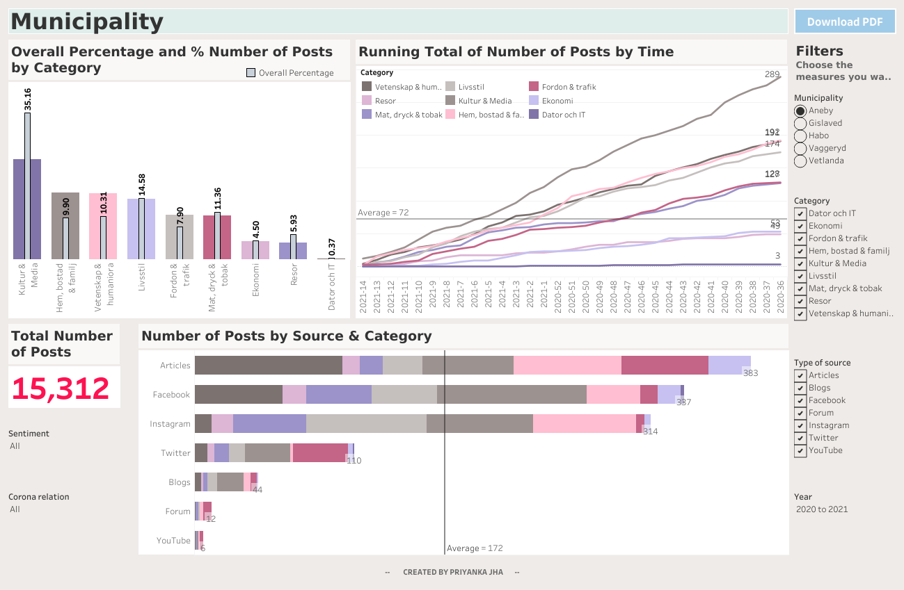
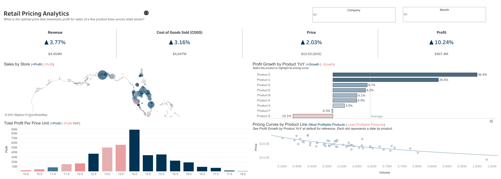
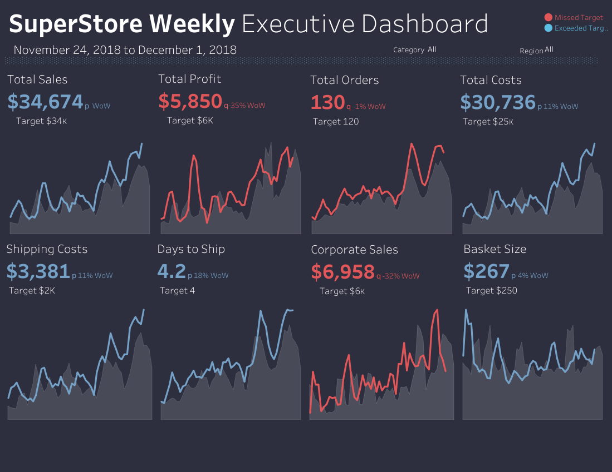
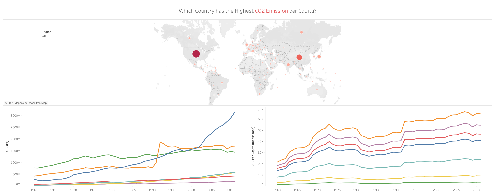

# Portfolio Projects
## Following are my projects in SQL, Python, Tableau & Excel:  
#### *You can also take a look at my Linkedin : [LinkedIn Profile](https://www.linkedin.com/in/mdtanvirahmeddev/)*  

- [x] **SQL & Tableau** - 
  - Instagram Clone Data Analysis Project 
*See on Tableau Public:* **[Dashboard](https://public.tableau.com/app/profile/md.tanvir.ahmed8315/viz/InstagramCloneDataAnalysisProject/InstagramCloneDataAnalysisDashboard)** 

- [x] **Hadoop (Hive)** - 
  - NYC Yellow Taxi Records: Data Analysis  
*Review the HiveQL Script:* **[HERE](https://github.com/PriyankaJhaTheAnalyst/DataAnalystPortfolioProjects/blob/main/Hadoop(Hive)%20-%20NYC%20Yellow%20Taxi%20Case%20Study.txt)** 

- [x] **SQL** - 
  - Nashville Housing Dataset: Data Cleaning  
*Review the SQL Script:* **[HERE](https://github.com/PriyankaJhaTheAnalyst/DataAnalystPortfolioProjects/blob/main/SQL%20-%20Data%20Cleaning.sql)** 

  - COVID-19 Dataset: Data Exploration   
*Review the SQL Script:* **[HERE](https://github.com/PriyankaJhaTheAnalyst/DataAnalystPortfolioProjects/blob/main/SQL%20-%20Data%20Exploration.sql)** 

- [x] **PostgreSQL** - 
  - Business Intelligence Challenge  
*Review the PostgreSQL Script:* **[HERE](https://github.com/PriyankaJhaTheAnalyst/DataAnalystPortfolioProjects/blob/main/PostgreSQL-BI-CHALLENGE)** 
*Review the Google Slides Deck to see the Data Visualizations:* **[HERE](https://drive.google.com/file/d/1JIDnsaLXAx2qnWM86yfrRKLWF5B_ofHU/view?usp=sharing)** 

- [x] **Python** - 
  - Movies Industry Dataset: Exploratory Data Analysis Project  
*Read the complete Project Analysis in Markdown:* **[HERE](https://github.com/PriyankaJhaTheAnalyst/Python_MoviesIndustry_EDA/blob/main/README.md)** 

- [x] **Tableau** - 

*To view these Tableau Dashboards in Tableau Public, click on the hypertext link.*

  

  

  

      
      1 KPI Dashboard

      2 Top-Down Dashboard
      

      3 Q&A Dashboard
      

      4 Bottom-Up Dashboard
      

      5 Geo Chart
      

- [x] **Excel** - 

*Kindly download these Excel files from this repository and view them in Microsoft Excel.*

- Sales Superstore Sample: Sales Performance Dashboard  

- NetTRON Network Infrastructure Data : LOOKUP, INDEX, MATCH, SUMIFS  

- Shipping Data: Pivot Tables, Pivot Chart, Slicers  

- Project Costing Model Data: Scenario Manager, Solver (Data Modeling)

--------------------------------------------------------------------------------------------------------------------------------------------------------------------------------
